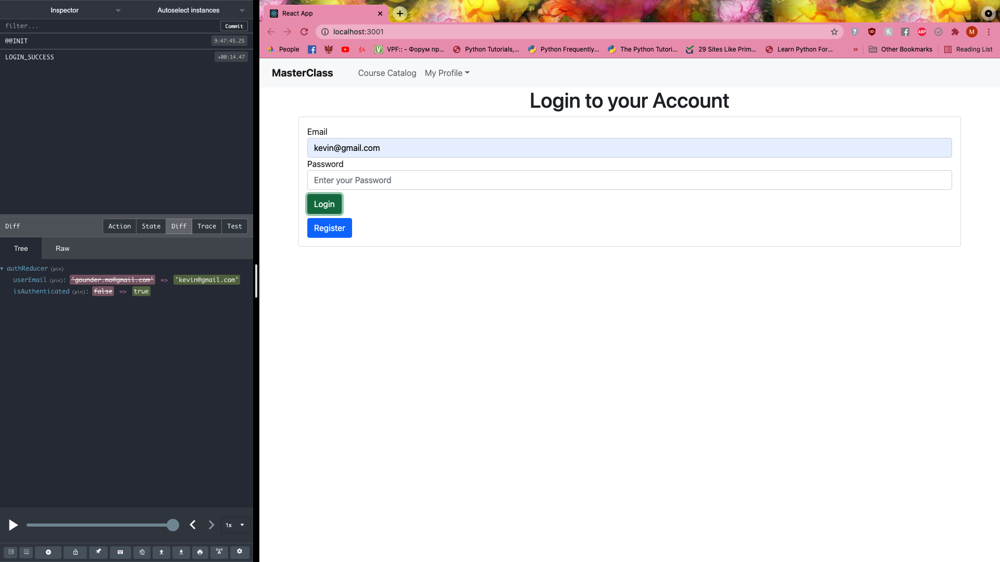

# masterclass-project

testing commit

Landing page and navbar

course catalog

Before login action (isAuthenticated is False, email is gounder.mo@gmail.com as default)

After inputting email (isAuthenticated is True)

After inputting a different email (email changes to kevin@gmail.com)

Get all Courses

All courses and added course to favorites (course favorite changed from False to True)

Favorited courses
![ScreenShot](Screen Shot 2021-09-15 at 9.08.07 PM.png
